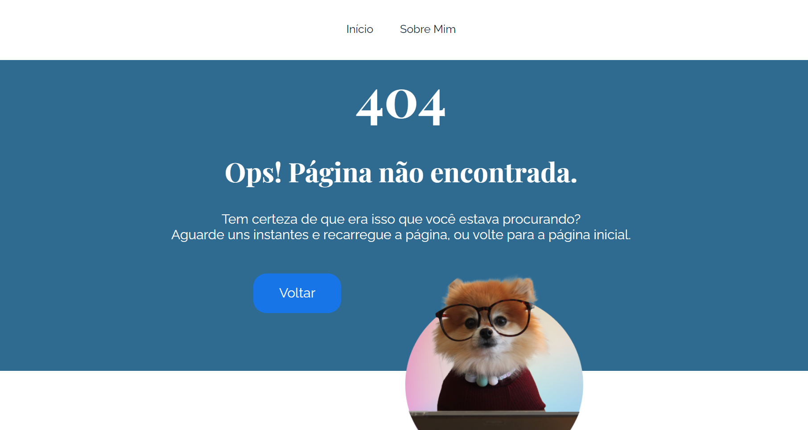

# Getting Started with Create React App

This project was bootstrapped with [Create React App](https://github.com/facebook/create-react-app). Developed by Fabio Barbosa with the help of Alura in the course "React: developing in React Router with JavaScript".

This website is composed of some screens. The inicial page, which contains an introduction, plus some articles to read.

On the page "Sobre Mim" (About Me), there is a small text talking about me and the project.

If you put a non-existent address, the site will relocate you to a 404 Error Page.  

I hope you glad this website!
